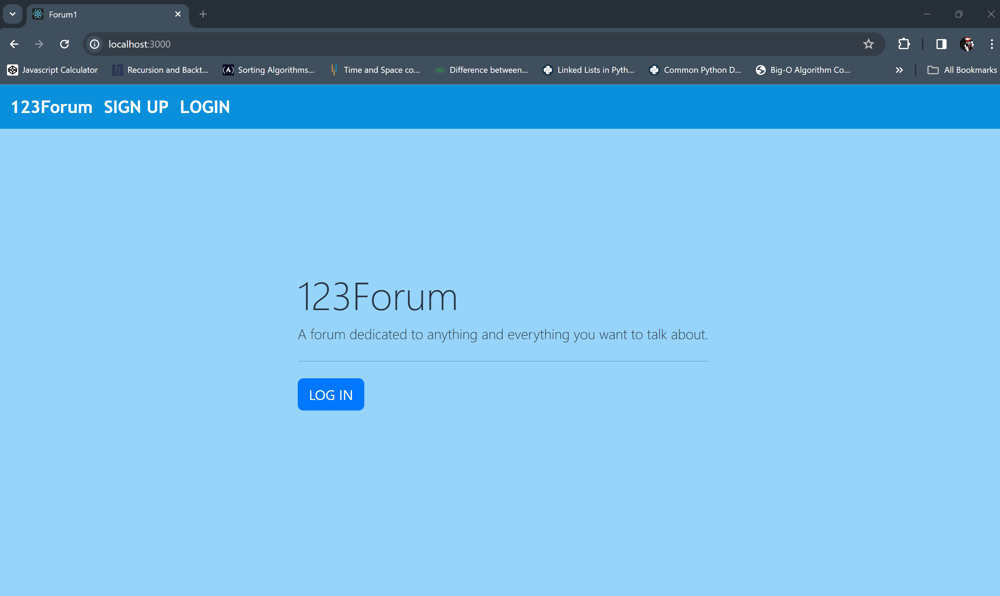

# CVWO Web Forum (by Chen Shaoheng)

A web forum created using React and Typescript for frontend and Ruby on Rails backend.

Link to deployed app: https://mysite-w3o1.onrender.com

## Getting Started
Running the App
1. Fork this repo.
2. Clone your forked repo.
3. Open your terminal and navigate to the directory containing your cloned project.
4. Set up the backend:
   - Ensure Ruby version 3.2.0 and Rails version 7.1.2 are installed
   - Run bundle install to install Ruby Gems
```bash
bundle install
```
   - Run rails db:migrate setup the database
5. Setup the frontend:
   - Run yarn install to install react frontend
6. Run rails/server
```bash
rails/server
```
7. Open http://localhost:3000 to view it in the browser.
8. You should see a page like this.
   
   

### Navigating the code

This is the main file structure

```
.
├── app
   ├──assets
      ├──stylesheets
         ├──application.bootstrap
   ├──javascript
      ├──components
      ├──routes
   ├──controllers
      ├──api
         ├──v1
   ├──models
├── config
   ├──route.rb
├── db
├── README.md
├── tsconfig.json
├── package.json
└── yarn.lock
.
.
.
```

Main directories/files to note:

-   `app` includes all the main code.
    - In assets/stylesheets, `application.bootstrap` contains the CSS, including usage of bootstrap library, for styling the frontend.
    - In `javascript/components`, the tsx files represent each React component that is rendered according to certain actions taken by the user and is responsble for all the frontend display.
    - In javascipt/routes, `index.tsx` file is responsible for handling routing, by rendering the corresponding React components for each path.
    - In `controllers/api/v1`, the controller files are the Ruby action controllers that will run a specific action based on a request specified by the frontend, and using the API, allow the React front end to retrieve data from the database to render it or insert user input into the database or delete/update database entries, thus allowing communication between the frontend and the backend to perform CRUD operations.
    - In `models`, the ruby files contain specifications for each of the three databases created: User, Post, and Comment.
- `config/routes.rb` contains all the routing that maps each request (eg get, post, delete) to a corresponding controller action, before rendering the output using a React component.
-   `db` contains database migration files that record all database migrations committed during the database creation and editing stage.
